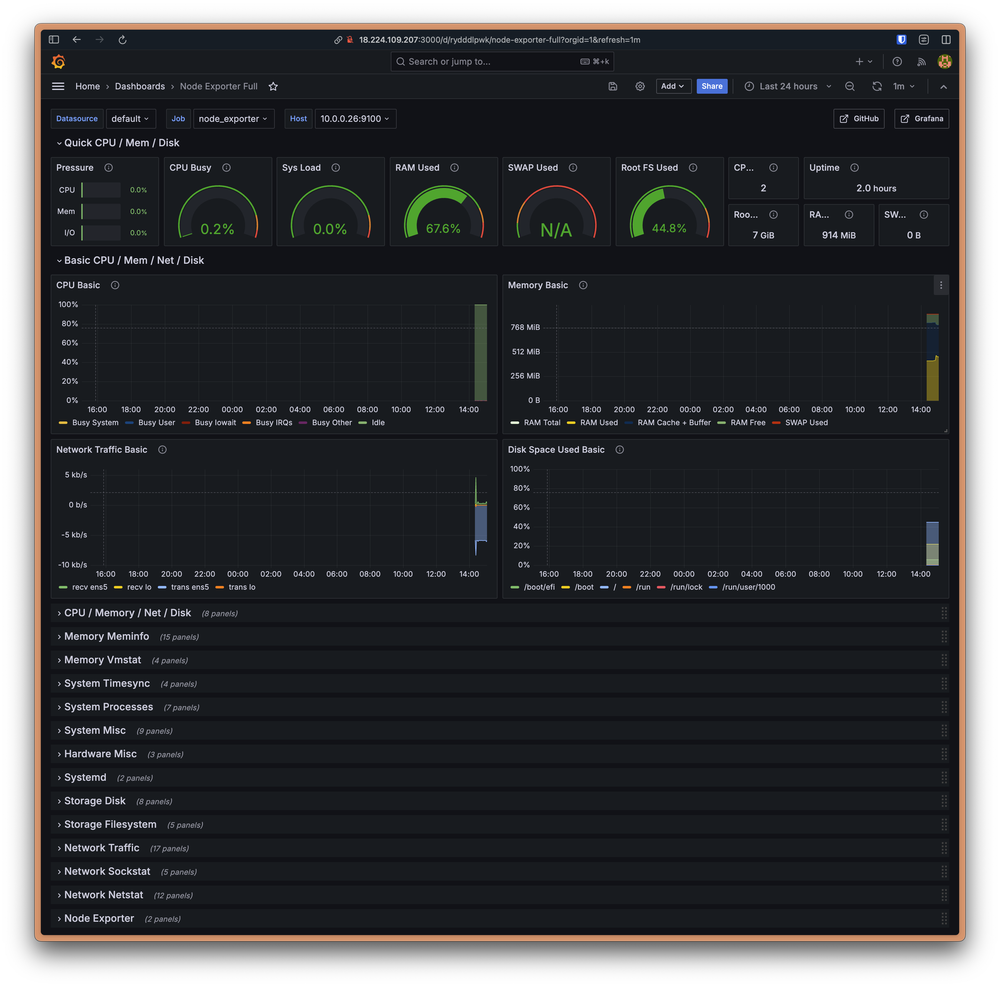
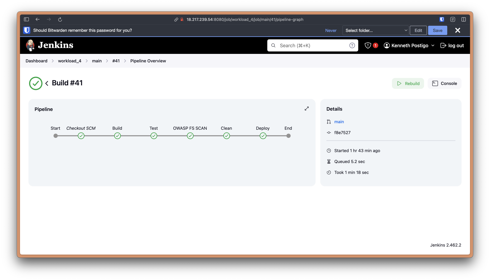
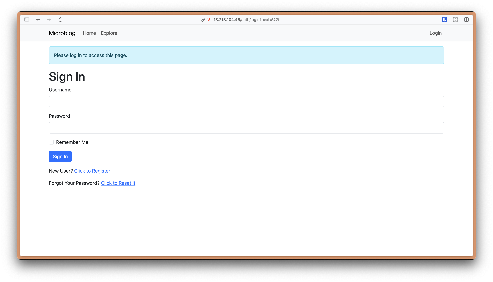
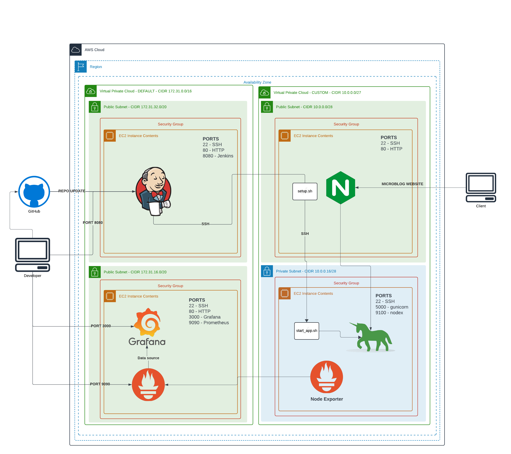

## Purpose

The purpose of this workload is to enhance our understanding of cloud infrastructure provisioning and deployment automation using AWS, focusing on building a more efficient and secure application deployment pipeline. This includes creating a custom Virtual Private Cloud (VPC) with a public and private subnet, establishing a CI/CD pipeline with Jenkins, and ensuring robust access control and monitoring. By focusing on best practices when self-provisioning a deployment, this project showcases the abiity to manage cloud resources and deploy applications effectively.

## Steps

1. Create a custom VPC with one availability zone, a public subnet, and a private subnet.
	1. Create a NAT Gateway in the availability zone (0 VPC Endpoints). DNS hostnames and DNS resolution should be selected
2. Set the public subnet to auto-assign public IPv4 addresses.
	- IPv4 CIDR block: 10.0.0.0/27 (32 available IPs, minus reserved addresses)
	- AZ: us-east-2a
	- public subnet: 10.0.0.0/28 (16 available IPs, minus reserved)
	- private subnet: 10.0.0.16/28 (16 available IPs, minus reserved)
1. In the default VPC (not custom VPC), create an EC2 t3.medium called "Jenkins" to install Jenkins onto it (used scp for `scripts/jenkins_setup.sh`)
	1. Security group ports: 22 (SSH) | 80 (HTTP) | 8080 (Jenkins)
	2. Create and save a key pair locally (named `wl4key.pem`)
2. In the custom VPC, create an EC2 t3.micro called "Web_Server" in the _public_ subnet.
	1. Security group ports: 22 (SSH) | 80 (HTTP)
	2. Reuse `wl4key.pem`
3. Also in the custom VPC, create an EC2 t3.micro called "Application_Server" in the _private_ subnet.
	1. Security group ports: 22 (SSH) | 5000 (gunicorn/nginx)
	2. Reuse `wl4key.pem`
4. SSH into the "Jenkins" server and run `ssh-keygen`. Append the public key that is created to `~/.ssh/authorized_keys` in the "Web_Server".
	1. Test the SSH connection to "Web_Server" from the "Jenkins" server. This adds the web server instance to the "list of known hosts" on "Jenkins". 
		> A "known host" is another way to describe a trusted host that has been connected to via SSH previously. Before connecting to a host for the first time, it is considered an unknown host. When you confirm that a host can be trusted when connecting, it is added to the `~/.ssh/known_hosts` file and you will not be prompted to verify the host's authenticity moving forward.
7. In the "Web_Server", install NginX and modify the `etc/nginx/sites-enabled/default` configuration file so that the `location` section reads as below:
   ```
   location / {
   proxy_pass http://<private_ip>:5000;
   proxy_set_header Host $host;
   proxy_set_header X-Forwarded-For $proxy_add_x_forwarded_for;
   }
   ```
  > Replace <private_ip> with the private IP address of the "Application_Server". Verify with `sudo nginx -t`, then restart with `sudo systemctl restart nginx`.
8. Copy the key pair of the "Application_Server" to the "Web_Server". Test the SSH connection to "Application_Server" from "Web_Server" (thus establishing a known host in the "Web_Server").
	1. We copy and rename the key from our local machine to the "Web_Server" via scp to accomplish this:
	> `scp -i path/to/wl4key.pem path/to/wl4key.pem ubuntu@$WEBSERV:~/.ssh/appservkey.pem`
9. Create `scripts/start_app.sh` that will run on the "Application_Server" to install the necessary environment (python/pip), clone this repository, install the app dependences, set environment variables (i.e FLASK_APP=microblog.py), run `flask` commands, and serve the app with `gunicorn`. Also create `scripts/setup.sh` that will run in the "Web_Server" to ssh into the "Application_Server" to run `start_app.sh`.
	1. Copy `scripts/start_app.sh` into the app server, and assign appropriate permissions (700):
	> `scp -i secrets/wl4key.pem scripts/start_app.sh ubuntu@$WEBSERV:~/start_app.sh && ssh -i secrets/wl4key.pem ubuntu@$WEBSERV "scp -i .ssh/appservkey.pem start_app.sh ubuntu@10.0.0.26:start_app.sh && rm start_app.sh && ssh -i .ssh/appservkey.pem ubuntu@10.0.0.26 "chmod 700 start_app.sh""`
	2. Copy `scripts/setup.sh` into the web server and assign permissions (700):
		> `scp -i secrets/wl4key.pem scripts/setup.sh ubuntu@$WEBSERV:~/setup.sh && ssh -i secrets/wl4key.pem ubuntu@$WEBSERV "chmod 700 setup.sh"`
	3. Running scripts with the source command is useful when a terminal session needs to access variables assigned within a script. Without the source command, the script will run in a subshell that completes without transferring/returning state.
10. Create a `Jenkinsfile` that will "Build" the app, "Test" the application with pytest, run the OWASP dependency checker, and then "Deploy" the app by SSH'ing into the web server to run `setup.sh`.
	1. We do not need to worry about "keeping the process alive" during the deploy stage because this stage is simply running a script in another server ("Application_Server") to actually deploy (start/restart) the app.
	2. For the OWASP stage, we set up an API key via the NVD website and add the API key as a credential to Jenkins, to be accessed in the OWASP stage.
11. Create a MultiBranch Pipeline and run the build, make sure you add the test files necessary so that the "Test" stage completes.
	1. When running this build at first, the gunicorn server was not able to be restarted because it needed to be killed first. For that reason, I created a `scripts/send_kill.sh` file that lives in the web server and is run by Jenkins in a "Clean" stage. When this script is run, the web server connects to the app server via SSH and runs the `scripts/kill_gunicorn.sh` script, which finds the gunicorn PID and kills it. This allows the Jenkins "Deploy" stage to successfully start gunicorn from scratch again.
	2. In order to achieve better provisioning automation from this network, I am setting up a VPC peering connection between the default and custom VPCs to reduce friction when connecting to servers via SSH. The route tables are updated to support the respective VPC CIDR block destinations with the peering connection ID.
		1. The web server's public (changing) IP is updated with it's private IP in Jenkin's server `/etc/environment` to avoid shutdown changes.
		2. Web server's `/etc/environment` keeps the app server IP variable the same (private IP).
		3. `setup.sh` and `send_kill.sh` (in web server) are updated to use environment variable for the app server IP, instead of having it coded in the script itself (commented out)
	3. Since I used multiple git branches for different aspects of this project, I included a `when` block to each of the Jenkins stages in order to only perform builds on the `main` branch.
12. For the final step, we create a "Monitoring" server running Prometheus and Grafana in the default VPC in order to monitor the application server.
	1. Install Prometheus and Grafana to the monitoring server using `scripts/promgraf.sh`.
		1. Configure Prometheus to use metrics from Node Exporter by editing `/opt/prometheus/prometheus.yml` then restart the prometheus service:
		   ```yaml
		   # my global config
			global:
			  scrape_interval: 15s # Set the scrape interval to every 15 seconds. Default is every 1 minute.
			  evaluation_interval: 15s # Evaluate rules every 15 seconds. The default is every 1 minute.
			  # scrape_timeout is set to the global default (10s).

			# Alertmanager configuration
			alerting:
			  alertmanagers:
			    - static_configs:
			        - targets:
			          # - alertmanager:9093

			# Load rules once and periodically evaluate them according to the global 'evaluation_interval'.
			rule_files:
			  # - "first_rules.yml"
			  # - "second_rules.yml"

			# A scrape configuration containing exactly one endpoint to scrape:
			# Here it's Prometheus itself.
			scrape_configs:
			  # The job name is added as a label `job=%3Cjob_name%3E` to any timeseries scraped from this config.
			  - job_name: "prometheus"

			    # metrics_path defaults to '/metrics'
			    # scheme defaults to 'http'.

			    static_configs:
			      - targets: ["localhost:9090"]
			  - job_name: "node_exporter"
			    static_configs:
			      - targets: ["APPSERVER_PRIVATE_IP:9100"]
			```
	2. Install Prometheus Node Exporter to the APP server using `scripts/setup_nodex.sh`. Open port 9100.
		1. Create a daemon process for node exporter in `/etc/systemd/system/node_exporter.service`:
		   ```
		   [Unit]
			Description=Node Exporter
			After=network.target

			[Service]
			User=ubuntu
			ExecStart=/usr/local/bin/node_exporter

			[Install]
			WantedBy=default.target
			```
		2. Reload `systemd` and start and enable `node_exporter`.
			1. `sudo systemctl daemon-reload`
			2. `sudo systemctl start node_exporter`
			3. `sudo systemctl enable node_exporter`
	3. Add Prometheus as a data source to grafana (http://localhost:9090), add a dashboard with grafana template ID 1860

### Grafana Dashboard



### Jenkins Pipeline Overview



### Microblog



## System Design Diagram



## Issues/Troubleshooting

All of the troubleshooting in this workload happened while working with Jenkins and the Jenkinsfile. Being aware of what the machine's Jenkins user has access to plays a pivotal role in a build's success. My experience with working with Jenkins and the Jenkinsfile in this workload has taught me about where to place environment variables (`/etc/environment`) for Jenkins to access, how to create credentials within Jenkins itself, and how to access both of these types of variables (ssh and api keys included) from within a Jenkinsfile.

Finally, the other troubleshooting step I had to take was when trying to restart my `gunicorn` process from the "Deploy" stage. Since there was no stage to kill the process beforehand, and the Deploy stage called a function to start `gunicorn`, there were 2 options that I considered. The first was to simply kill `gunicorn` from the `start_app.sh` script itself to be run during the deploy stage, or create a separate stage entirelt ("Clean") that SSH's into the web server to run a script (`send_kill.sh`) that runs another script inside the application server via SSH to kill the `gunicorn` process (`kill_gunicorn.sh`). I decided to create a "Clean" stage because it allowed me to practice `scp` and `ssh` commands to get the correct scripts to their respective servers without having to copy/paste the files manually into each server.

## Optimization

Considering that we are provisioning our own infrastructure for this project, this workload leaves room for optimization in the form of automation. Even though we are learning to automate certain parts of the self-provisioning method of deploying infrastructure, there is still the option of using a managed service that handles infrastructure for us. The downside to doing this is that there is less fine-grained control over the project's infrastructure, and an increase in cost associated with maintaining the application.

If we were to stay in the self-provisioning paradigm, we could further optimize the infrastructure for this application by increasing redundancy (extra AZ's, instances), and improving security (adding NACLs for more control over the network flow, specifying IPs or assigning roles to developers for specific access control of certain instances/subnets).

## Conclusion

In conclusion, this project has successfully demonstrated the intricacies of cloud infrastructure provisioning and deployment automation using AWS and Jenkins, resulting in the creation of a successful application deployment pipeline. By implementing a custom VPC with instances in both public and private subnets, we have gained practical experience in infrastructure design, automated deployments via Jenkins, and secure access control through the use of security groups. Integrating a monitoring server with Prometheus and Grafana added to our learning by leveraging platform agnostic tools that can be used beyond AWS-based systems. There is still potential for optimization, especially in enhancing automation and security, eventually making for more efficient cloud infra management.
